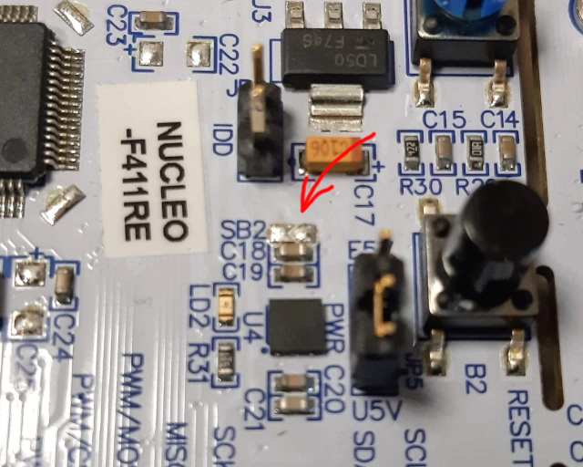

# pqpowershield

2019-10-01  Markku-Juhani O. Saarinen <mjos@pqshield.com>


# Executive Summary and Findings

My motivation was to establish a straightforward model from "cycle counts" to 
"Joules" for the Cortex M4 target in the context of new (post-quantum)
asymmetric cryptographic algorithms. The null hypothesis was that the 
relationship is linear and largely algorithm-independent, this turned
out *not* to be true. 

In practice we
saw current wander between 10 mA and 38 mA with stabilized 3V voltage,
corresponding to 30 mW .. 114 mW range. Algorithms were clocked at
96 MHz; cycle timing was used together with integrated average energy
of each primitive to derive an energy profile for each tested algorithm.

Power consumption is not constant, but is largely dependant on the 
instruction mix of the particular algorithm being tested. 
Very consistently and unexpectedly e.g. the NTRU key generation
routine requires only half of the wattage of decapsulation of the same
algorithm.

I did four randomized trials for each target algorithm, 
running each component for at least 10 seconds in each (typically
tens or hundreds of iterations), and the results
were reasonable consistent. You may look at the semiprocessed data 
[parsed_data.txt](parsed_data.txt) if you like.


##  Tools used

This little tutorial and software package explains how to use the
[X-NUCLEO-LPM01A](https://www.st.com/en/evaluation-tools/x-nucleo-lpm01a.html),
a high-precision controlled power supply board to measure power consumption of 
cryptographic algorithms of a Cortex M4 target. The board is commonly
called "PowerShield" in ST documentation, and I'll it as self. Note that
the PowerShield is used in the "industry standard" Ultra-Low Power (ULP)
benchmark [ULPMark](https://www.eembc.org/ulpmark/) as well.

The PowerShield can be used in many ways, but the main intended configuration
is to create a development board sandwich with a STM32 Nucleo-32/64/144 board
using Arduino connectors (the number refers to number of pins in the
LQFP or UFQFPN packaging of the MCU chip; has nothing to do with "bits").


This excludes some older boards such as
[STM32F407G-DISC1](https://www.st.com/en/evaluation-tools/stm32f4discovery.html)
that is used by the [PQM4](https://github.com/mupq/pqm4) project where I will
be lifting most of the evaluation targets from. The "discovery board" is
also little bit awkward as it requires an additional USB serial 
dongle (or a hardware mod) for serial communications.

So I chose to use the cheaper
[NUCLEO-F411RE](https://www.st.com/en/evaluation-tools/nucleo-f411re.html)
board. This board also has an external
(SMPS) to generate Vcore logic supply, which is precisely what we want and
use. Mostly the specs of STM32F411RE (this Nucleo) are similar to
STM32F407VGT6 (Discovery); importantly both are Cortex M4 with 
(single-precision) floating point and DSP instructions. The F411RE has
only 512kB of Flash and 128kB of SRAM and lacks a TRNG, and can be
clocked only to 100 MHz; however it comes from the "Dynamic Efficiency" 
product line, being hopefully more efficient than the Discovery.


**Manuals**

* [UM2243](https://www.st.com/resource/en/user_manual/dm00406577.pdf)
User Manual: STM32 Nucleo expansion board for power consumption measurement

* [UM2269](https://www.st.com/resource/en/user_manual/dm00418905.pdf)
User manual: Getting started with PowerShield firmware

* [UM1724](https://www.st.com/resource/en/user_manual/dm00105823.pdf)
User Manual: STM32 Nucleo-64 boards (MB1136) 

* [STM32F411RE](https://www.st.com/resource/en/datasheet/stm32f411re.pdf)
Datasheet: STM32F411xC STM32F411xE Arm Cortex-M4 32b MCU+FPU, 125 DMIPS, 
512KB Flash, 128KB RAM, USB OTG FS, 11 TIMs, 1 ADC, 13 comm. interfaces

* [RM0383](https://www.st.com/resource/en/reference_manual/dm00119316.pdf)
Reference Manual: STM32F411xC/E advanced Arm-based 32-bit MCUs (big!)


### So.. What kind of gear do I need?

I use [Ubuntu Linux](https://ubuntu.com/desktop) 18.04 LTS and (free) open 
source tools in this lab.

We paid £53.68 for the X-NUCLEO-LPM01A (PowerShield) board and £10.48 for 
NUCLEO-F411RE (Target) with a local UK component retailer in September 2019.
There seems to be good availablity of these boards; we had them delivered
the following day.

The PowerShield has a micro-B USB connector, while Nucleo-64 boards have a
Mini-B connector. So you need both of these cables to connect to your PC's 
Type-A (that common big USB) or Type-C (new) connectors (£5). 

It's helpful to have an USB extension cable and an USB hub with individual
on/off switches for each ports (something like £10).

#### Software

For building on Debian/Ubuntu you'll need "make" and other build essentials 
(`sudo apt install build-essential`) and also a suitable ARM cross compiler.

You can install the default compilers with `sudo apt install gcc-arm-none-eabi`
(or similar). I'm using 
`GNU Tools for Arm Embedded Processors 8-2019-q3-update` downloaded
from the [ARM Website](https://developer.arm.com/tools-and-software/open-source-software/developer-tools/gnu-toolchain/gnu-rm/downloads) myself.

For flashing the target I use `st-flash` which is part of the open source
[stlink](https://github.com/texane/stlink) package. I built this from 
sources.

The scripts use bash and Python3 for serial communication
(`sudo apt install python3-serial` and dependencies).


## Measurement Mods

There are other measurement options, but this is the currenct configuration
used in measurements.

* On PowerShield: Jumpers of power supply pin: Close jumper AREF_ARD, 
	open jumper 3V3_ARD.
* On Nucleo64: Open Jumper IDD. 
* On Nucleo64: Remove solder bridge SB12 to disconnect reset signal
from ST-Link part.
* On Nucleo64: Remove solder bridge SB2 disconnecting 3.3V voltage
	regulator LD39050PU33R.

I followed the instructions in Section 1.2 of UM2269 "Quick setup to measure 
current on board Nucleo64" (AREF_ARD, 3V3_ARD, IDD, SB12) and additionally
disconnected SB2; Section 6.3.3 of UM1724 "External power supply input: +3.3V".

UM1724 states that "SB12 NRST (target STM32 RESET) must be OFF if CN4 pin 5 is 
used in the external application." Anyway, this is not your typical 
accidental solder bridge but a surface-mounted zero-ohm resistor. 
Just carefully heat both ends of the resistor until it comes off. 
Since there is some solder residue, I used a multimeter to check that
the connection is really off.

|  |  |  |  |
|:---:|:---:|:---:|:---:|
|Jumpers on PowerShield.|IDD Jumper on Nucleo64.|Solder Bridge SB12.|Solder Bridge SB2.|

The current measurement script `main.cpp` uses D7 on the Nucleo64 board
to trigger measurements. This is supported by the standard firmware.


### Note on the serial interface

We will be dealing with two serial interfaces simultaneously; on my
system the they appear as `/dev/ttyACM0` and  `/dev/ttyACM1`; in order to 
find their unique identifier paths, list: `ls /dev/serial/by-id`. 

The PowerShield line feed dicipline is little strange. For direct access
I use picocom (`sudo install picocom`) like this (as noted, the path
can be different for you):

```
picocom --echo --imap lfcrlf --omap crlf /dev/serial/by-id/usb-STMicroelectronics_PowerShield__Virtual_ComPort_in_FS_Mode__FFFFFFFEFFFF-if00
```

Try issuing the `help` command to get a command summary. 

UM2269 states that the PowerShield baudrate is 3686400, but I really don't 
know how to make that work (it actually sounds crazy high). 
`setserial -av <powershield device>` gives a base rate of 38400 anyway.

The pqps firmware is 

## Building and testing

The measurement is ran on implementations from the 
[pqm4](https://github.com/mupq/pqm4) "Post-quantum crypto library for the 
ARM Cortex-M4". However I'm using a different target board and the 
[ARM Mbed OS v2](https://os.mbed.com/) runtime libraries instead of
[libopencm3](https://github.com/libopencm3). 

So, first get the distribution and unpack pqm4 inside it:
```
git clone https://github.com/mjosaarinen/pqps.git
cd pqps
git clone --recursive https://github.com/mupq/pqm4.git
```

If everything is fine, you can attempt to build some target with

```
$make PQALG=pqm4/crypto_kem/kyber768/m4

[CPP] main.cpp
[AS] aes.S
[AS] keccakf1600.S
[CC] randombytes.c
[CC] aes.c
[CC] sha2.c
[CC] fips202.c
[CC] sp800-185.c
[CC] cbd.c
[CC] polyvec.c
[CC] ntt.c
[CC] reduce.c
[CC] symmetric-fips202.c
[CC] poly.c
[CC] verify.c
[CC] kem.c
[CC] indcpa.c
[AS] fastntt.S
cp ../mbed/TARGET_NUCLEO_F411RE/TOOLCHAIN_GCC_ARM/STM32F411XE.ld pqps.link_script.ld
link: pqps.elf
arm-none-eabi-objcopy -O ihex pqps.elf pqps.hex
```

The `PQALG` argument is needed and points to a directory containing
the target implementation. If thigns were successful, 
`BUILD/pqps.hex` contains a firmware image that can be flashed with

```
$ st-flash --format ihex write BUILD/pqps.hex

st-flash 1.5.1-16-g1165cf7
2019-10-01T13:36:18 INFO common.c: Loading device parameters....
2019-10-01T13:36:18 INFO common.c: Device connected is: F4 device (low power) - stm32f411re, id 0x10006431
2019-10-01T13:36:18 INFO common.c: SRAM size: 0x20000 bytes (128 KiB), Flash: 0x80000 bytes (512 KiB) in pages of 16384 bytes
2019-10-01T13:36:18 INFO common.c: Attempting to write 84332 (0x1496c) bytes to stm32 address: 134217728 (0x8000000)
Flash page at addr: 0x08010000 erasedEraseFlash - Sector:0x4 Size:0x10000 
2019-10-01T13:36:20 INFO common.c: Finished erasing 5 pages of 65536 (0x10000) bytes
2019-10-01T13:36:20 INFO common.c: Starting Flash write for F2/F4/L4
2019-10-01T13:36:20 INFO flash_loader.c: Successfully loaded flash loader in sram
Target voltage (51 mV) too low for 32-bit flash, using 8-bit flash writes
size: 32768
size: 32768
size: 18796
2019-10-01T13:36:22 INFO common.c: Starting verification of write complete
2019-10-01T13:36:23 INFO common.c: Flash written and verified! jolly good!
```

**NOTE**  The target board needs power to be programmed; on initial
run you can allow this via the menus (and joystick) on the PowerShield;
just press the big square "ENTER" button.

You can try interacting with the default firmware with (replace the
device identifier with that of your target):

```
$ picocom --echo -b 115200 --imap lfcrlf --omap crlf /dev/serial/by-id/usb-STMicroelectronics_STM32_STLink_0672FF535155878281153855-if02

[...]
Terminal ready

[RESET] This is PQPowerShield! Welcome.

SystemCoreClock         96000000
CRYPTO_ALGNAME          Kyber768
CRYPTO_SECRETKEYBYTES   2400
CRYPTO_PUBLICKEYBYTES   1184
CRYPTO_CIPHERTEXTBYTES  1088
CRYPTO_BYTES            32
[INPUT] a = all, k = keygen, e = encaps, d = decaps
a
[START] measure(10000,kg,enc,dec)
[END] 10023 milliseconds, n=298 (0 errors)
*** KeyGen       978424 Kyber768
*** Encaps      1150505 Kyber768
*** Decaps      1099639 Kyber768
*** Total       3228569 Kyber768
[INPUT] a = all, k = keygen, e = encaps, d = decaps
```

## Measurements

* Take a look at `main.cpp` to see what you want to actually measure.

* The script running a set of energy measurements is contained in `psctrl.py`;
you'll have to modify at least the serial device identifiers for this to work.

* A shell script `test_alg.sh` will measure every implementation it can find,
in random order and write results to `logs`.

* A python script `parselog.py` is used to interpret these results.

* After four randomized runs, which took a couple of days, I produced the 
file `parsed_data.txt` with

```
$ for f in log/*; do echo $f; cat $f | ./parselog.py;echo; done > parsed_data.txt
```


### NOTE

(c) 2019  PQShield Ltd. No warranty whatsoever; use at your own risk.

