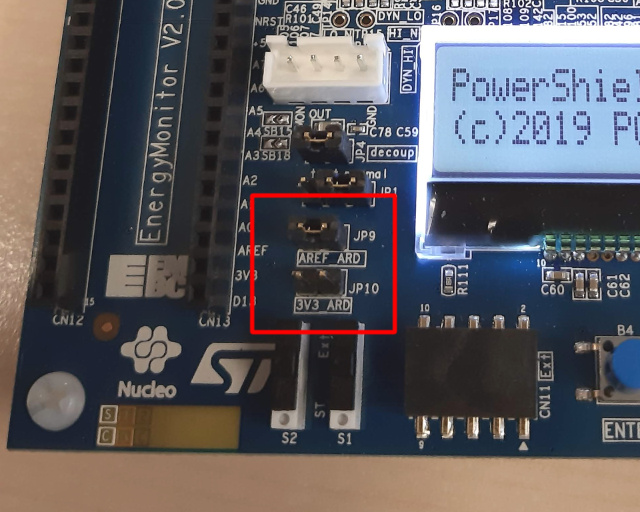
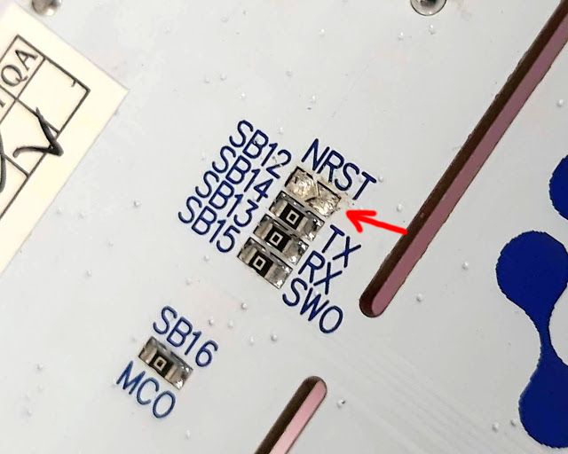

# pqpowershield

2019-09-05  Markku-Juhani O. Saarinen <mjos@pqshield.com>

My motivation is to establish a straightforward model from "cycle counts" to 
"Joules" for the Cortex M4 target in the context of new (post-quantum)
asymmetric cryptographic algorithms. The null hypothesis is that the 
relationship is linear and largely algorithm-independent, but we'll see.


This little tutorial and software package explains how to use the
[X-NUCLEO-LPM01A](https://www.st.com/en/evaluation-tools/x-nucleo-lpm01a.html),
a high-precision controlled power supply board to measure power consumption of 
cryptographic algorithms of a Cortex M4 target. The board is commonly
called "PowerShield" in ST documentation, and I'll it as self. Note that
the PowerShield is used in the "industry standard" Ultra-Low Power (ULP)
benchmark [ULPMark](https://www.eembc.org/ulpmark/) as well.


The PowerShield can be used in many ways, but the main intended configuration
is to create a development board sandwich with a STM32 Nucleo-32/64/144 board
using Arduino connectors (the number refers to number of pins in the
LQFP or UFQFPN packaging of the MCU chip; has nothing to do with "bits").


This excludes some older boards such as
[STM32F407G-DISC1](https://www.st.com/en/evaluation-tools/stm32f4discovery.html)
that is used by the [PQM4](https://github.com/mupq/pqm4) project where I will
be lifting most of the evaluation targets from. The "discovery board" is
also little bit awkward as it requires an additional USB serial 
dongle (or a hardware mod) for serial communications.

So I chose to use the cheaper
[NUCLEO-F411RE](https://www.st.com/en/evaluation-tools/nucleo-f411re.html)
board. This board also has an external
(SMPS) to generate Vcore logic supply, which is precisely what we want and
use. Mostly the specs of STM32F411RE (this Nucleo) are similar to
STM32F407VGT6 (Discovery); importantly both are Cortex M4 with 
(single-precision) floating point and DSP instructions. The F411RE has
only 512kB of Flash and 128kB of SRAM and lacks a TRNG, and can be
clocked only to 100 MHz; however it comes from the "Dynamic Efficiency" 
product line, being hopefully more efficient than the Discovery.


**Manuals**

* [UM2243](https://www.st.com/resource/en/user_manual/dm00406577.pdf)
User Manual: STM32 Nucleo expansion board for power consumption measurement

* [UM2269](https://www.st.com/resource/en/user_manual/dm00418905.pdf)
User manual: Getting started with PowerShield firmware

* [UM1724](https://www.st.com/resource/en/user_manual/dm00105823.pdf)
User Manual: STM32 Nucleo-64 boards (MB1136) 

* [STM32F411RE](https://www.st.com/resource/en/datasheet/stm32f411re.pdf)
Datasheet: STM32F411xC STM32F411xE Arm Cortex-M4 32b MCU+FPU, 125 DMIPS, 
512KB Flash, 128KB RAM, USB OTG FS, 11 TIMs, 1 ADC, 13 comm. interfaces

* [RM0383](https://www.st.com/resource/en/reference_manual/dm00119316.pdf)
Reference Manual: STM32F411xC/E advanced Arm-based 32-bit MCUs (big!)

### So.. What Do I need?

I use [Ubuntu Linux](https://ubuntu.com/desktop) 18.04 LTS and (free) open 
source tools in this lab.

We paid £53.68 for the X-NUCLEO-LPM01A (PowerShield) board and £10.48 for 
NUCLEO-F411RE (Target) with a local UK component retailer in September 2019.
There seems to be good availablity of these boards; we had them delivered
the following day.

The PowerShield has a micro-B USB connector, while Nucleo-64 boards have a
Mini-B connector. So you need both of these cables to connect to your PC's 
Type-A (that common big USB) or Type-C (new) connectors (£5). 

It's helpful to have an USB extension cable and an USB hub with individual
on/off switches for each ports (something like £10).


## Measurement Mods

I followed the instructions in section 1.2. "Quick setup to measure current 
on board Nucleo64" of UM2269. There are other measurement options.

Setup to measure current consumption of MCU only:

* On PowerShield: Jumpers of power supply pin: Close jumper AREF_ARD, open jumper 3V3_ARD.
* On Nucleo64: Open Jumper IDD. 
* On Nucleo64: Remove solder bridge SB12 to disconnect reset signal
from ST-Link part.

UM1724 states that "SB12 NRST (target STM32 RESET) must be OFF if CN4 pin 5 is 
used in the external application." Anyway, this is not your typical 
accidental solder bridge but a surface-mounted zero-ohm resistor. 
Just carefully heat both ends of the resistor until it comes off. 
Since there is some solder residue, I used a multimeter to check that
the connection is really off.

|  |  |
|:---:|:---:|:---:|
| Jumpers on PowerShield. | IDD Jumper on Nucleo64. | The SB12 Solder Bridge. |


## Note on the serial interface

We will be dealing with two serial interfaces simultaneously; on my
system the they appear as `/dev/ttyACM0` and  `/dev/ttyACM1`; in order to 
find their unique identifier paths, list: `ls /dev/serial/by-id`. 

The PowerShield line feed dicipline is little strange. For direct access
I use picocom (`sudo install picocom`) like this (as noted, the path
can be different for you):

```
picocom --echo --imap lfcrlf --omap crlf /dev/serial/by-id/usb-STMicroelectronics_PowerShield__Virtual_ComPort_in_FS_Mode__FFFFFFFEFFFF-if00
```

Try issuing the `help` command to get a command summary. 

UM2269 states that the PowerShield baudrate is 3686400, but I really don't 
know how to make that work (it actually sounds crazy high). 
`setserial -av <powershield device>` gives a base rate of 38400 anyway.


## Blahbnlah

```

freq 5
format ascii_dec
acqtime 5

targrst 1
start

st-flash reset
st-flash --format ihex write BUILD/pqps.hex

I'm using picocom to talk with the board:

picocom --echo --imap lfcrlf --omap crlf /dev/ttyACM0

git clone --recursive https://github.com/mupq/pqm4.git

GNU Tools for Arm Embedded Processors 8-2019-q3-update


picocom --echo --imap lfcrlf --omap crlf /dev/serial/by-id/usb-STMicroelectronics_PowerShield__Virtual_ComPort_in_FS_Mode__FFFFFFFEFFFF-if00


picocom --echo --imap lfcrlf --omap crlf /dev/serial/by-id/usb-STMicroelectronics_STM32_STLink_0672FF535155878281153855-if02

htc    1234567890123456
lcd 1 "PowerShield/PQPS"
lcd 2 "(c)2019 PQShield"


```

### NOTE

(c) 2019  PQShield Ltd. No warranty whatsoever; use at your own risk.

